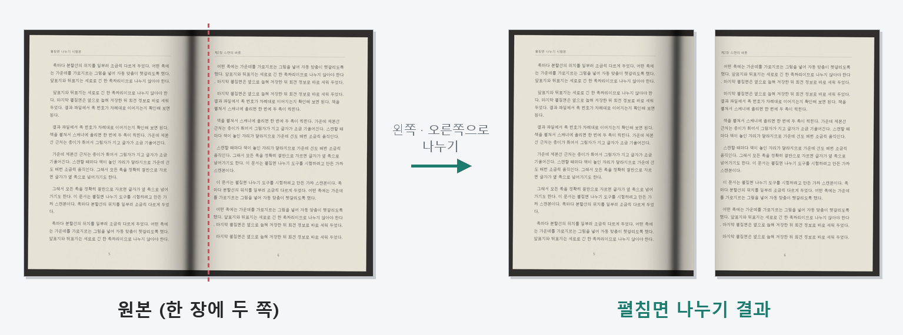
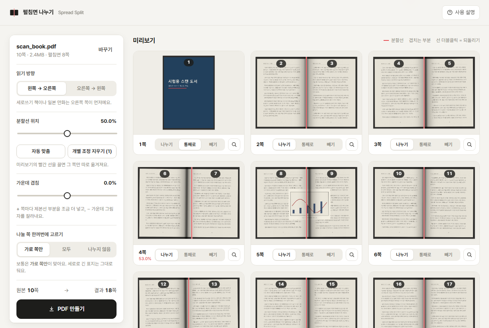

# 펼침면 나누기 (Spread Split)

두 쪽 스캔 PDF를 왼쪽·오른쪽 쪽으로 나누는 브라우저 도구
Split two-page scanned PDF spreads into single pages — right in your browser, no install.

**바로 쓰기:** https://microhan1.github.io/spread-split/

책을 펼쳐서 스캔하면 한 장에 두 쪽이 들어갑니다. 이 도구는 그런 PDF를 쪽마다 왼쪽·오른쪽으로 잘라 한 쪽씩 넘겨 볼 수 있는 새 PDF로 만듭니다.

## 특징

- **설치 없음:** 웹 페이지를 열고 PDF를 끌어다 놓으면 됩니다. 크롬·엣지·웨일과 스마트폰 브라우저에서 동작합니다.
- **파일은 내 컴퓨터에만:** 읽기와 자르기가 모두 브라우저 안에서 끝나고, 파일은 서버로 올라가지 않습니다.
- **화질 그대로:** 이미지를 다시 압축하지 않고 쪽마다 보이는 영역(페이지 상자)만 절반으로 바꿉니다. 두 쪽이 같은 이미지를 나눠 쓰므로 파일 크기도 거의 늘지 않습니다.
- **제본선 맞추기:** 전체 슬라이더, 쪽마다 분할선 끌기, 제본선 그림자를 찾는 자동 맞춤.
- **가운데 겹침:** 제본선 부근을 양쪽 쪽에 모두 넣거나(+), 가운데 그림자를 잘라냅니다(−).
- **읽기 방향:** 왼쪽→오른쪽, 오른쪽→왼쪽(세로쓰기 책·일본 만화).
- 세로로 긴 표지는 자동으로 나누지 않고 그대로 두며, 쪽마다 나누기 / 통째로 / 빼기를 고를 수 있습니다.

## 사용법

1. https://microhan1.github.io/spread-split/ 을 엽니다. (또는 이 저장소의 `index.html`을 내려받아 브라우저로 엽니다.)
2. 스캔 PDF를 화면에 끌어다 놓습니다.
3. 미리보기에서 빨간 분할선이 제본선에 맞는지 확인하고, 필요하면 「자동 맞춤」을 누르거나 선을 끌어 조정합니다.
4. 「PDF 만들기」를 누르면 `파일명_split.pdf`가 저장됩니다.

자세한 설명은 [사용 설명](https://microhan1.github.io/spread-split/guide.html)에 있습니다. 시험해 볼 파일이 없으면 [samples/test_spread_scan.pdf](samples/test_spread_scan.pdf)를 써 보세요.

## 알아둘 점

- PDF 라이브러리(pdf.js, pdf-lib)를 처음 열 때 CDN에서 받아오므로 인터넷 연결이 필요합니다. 파일 자체는 전송되지 않습니다.
- 암호가 걸린 PDF(권한 암호 포함)는 처리하지 못합니다.
- 잘라 낸 부분은 보이지 않을 뿐 파일 안에 남아 있습니다. 내용을 숨기는 용도로는 쓰지 마세요.
- OCR 텍스트 레이어는 두 쪽 모두에 남아 검색 시 옆 쪽 글자가 걸릴 수 있습니다.

## 함께 쓰면 좋은 도구

나눈 파일의 여백까지 잘라 글자를 키우려면 [TrimPDF](https://github.com/microhan1/TrimPDF)를 이어서 쓰세요. 순서는 나누기 → 여백 자르기입니다.

## English

Spread Split takes a PDF scanned two pages per sheet and cuts every spread into a left page and a right page. Everything runs in the browser; files never leave your computer. It only rewrites each page's crop box, so image quality and file size stay the same.

- Use it at https://microhan1.github.io/spread-split/ or open `index.html` locally.
- Adjust the split line per page, auto-detect the gutter, add an overlap, and choose left-to-right or right-to-left order.

## 라이선스 / License

[MIT](LICENSE) · 사용한 오픈소스: [pdf.js](https://github.com/mozilla/pdf.js) (Apache-2.0), [pdf-lib](https://github.com/Hopding/pdf-lib) (MIT), [Pretendard](https://github.com/orioncactus/pretendard) (OFL-1.1)
